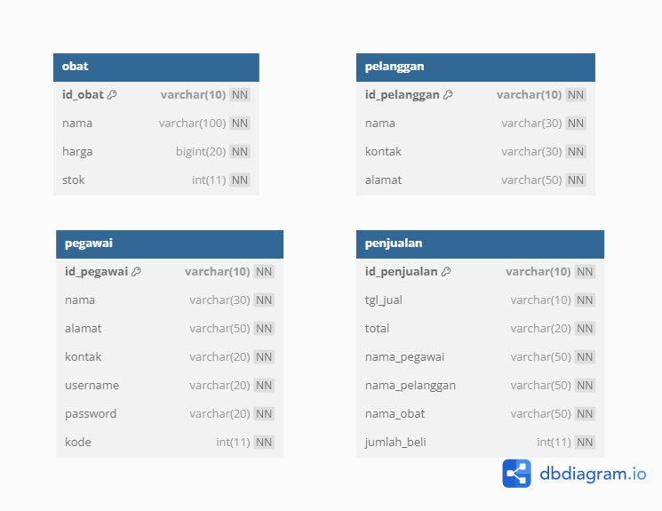

# Drugmacy

This repository is a final project (Java GUI) from Object-Oriented Programming Class, Teknik Informatika Universitas Padjadjaran. 

[Challenge Guidelines](challenge-guideline.md)

Drugmacy adalah aplikasi apotek yang memudahkan pengguna dalam membeli obat. Fitur dalam Drugmacy mencakup ketersediaan obat yang beragam, pembayaran aman, dan pengiriman cepat. Dengan User Interface yang ramah, Drugmacy menyediakan pengalaman belanja obat yang efisien dan nyaman.

## Credits
| NPM           | Name        |
| ------------- |-------------|
| 140810220020  | Nurkahfi Amran Rahmada    |
| 140810220076  | Tabina Adelia Rafa    |
| 140810220078  | Anel Fuad Abiyyu |

## Change log
- **[Sprint Planning](changelog/sprint-planning.md) - (26 November 2023)** 
   - Diskusi Ide Apotek 
   - Mencari Nama Apotek
   - Membuat Sprint Planning

- **[Sprint 1](changelog/sprint-1.md) - (date from 26 November 2023 until 27 November 2023)** 
   - Skema Database
   - Database Connection
   - Inisialisasi JFrame

- **[Sprint 2](changelog/sprint-2.md) - (date from 27 November until 29 November)** 
   - Buat Halaman Login
   - Buat Halaman Dashboard
   
- **[Sprint 3](changelog/sprint-3.md) - (date from 30 November until 7 December)** 
   - Buat Halaman Transaksi
   - Finishing App

## Running The App

- Buka Folder Drugmacy
- Import db_drugmacy.sql pada phpMyAdmin
- Nyalakan MySQL pada XAMPP atau aplikasi sejenis
- Buka Drugmacy.jar
- Aplikasi siap dijalankan

## Classes Used

TO;DO

UML image here

## Table Used

## Notable Assumption and Design App Details

TO;DO